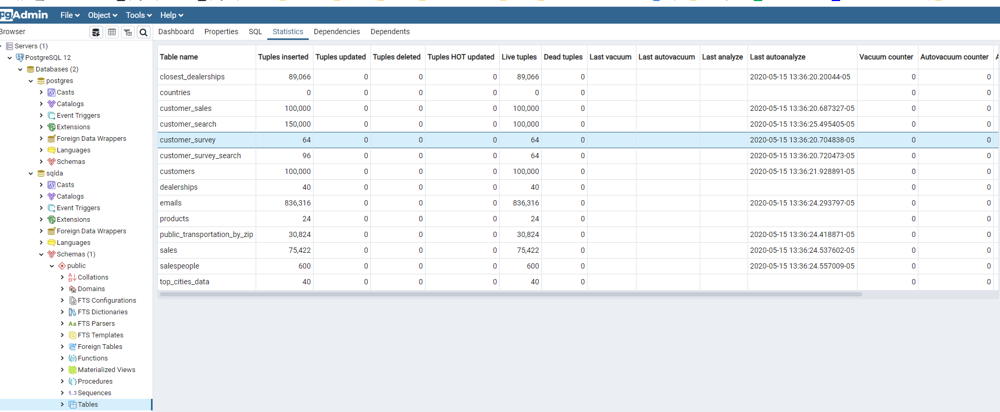
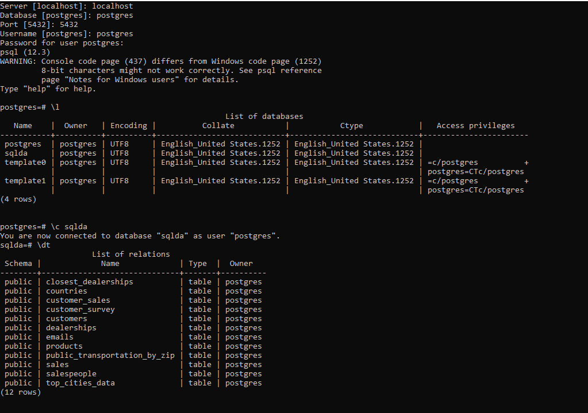
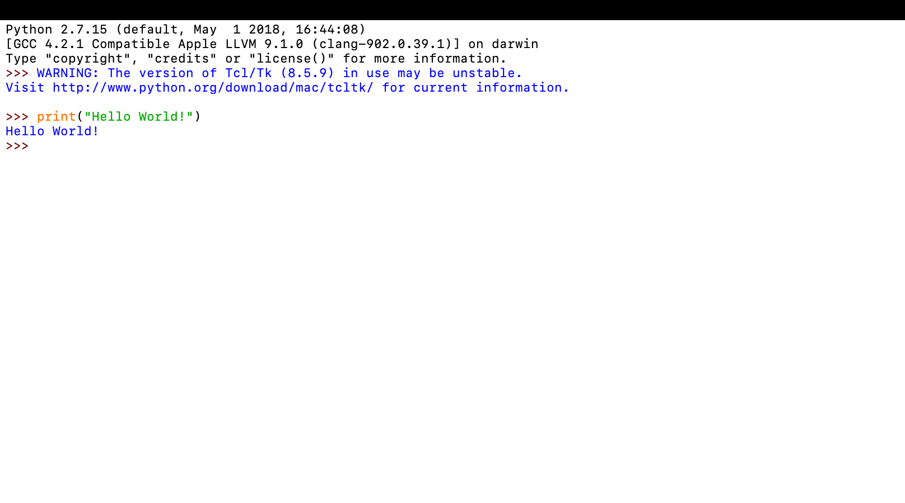
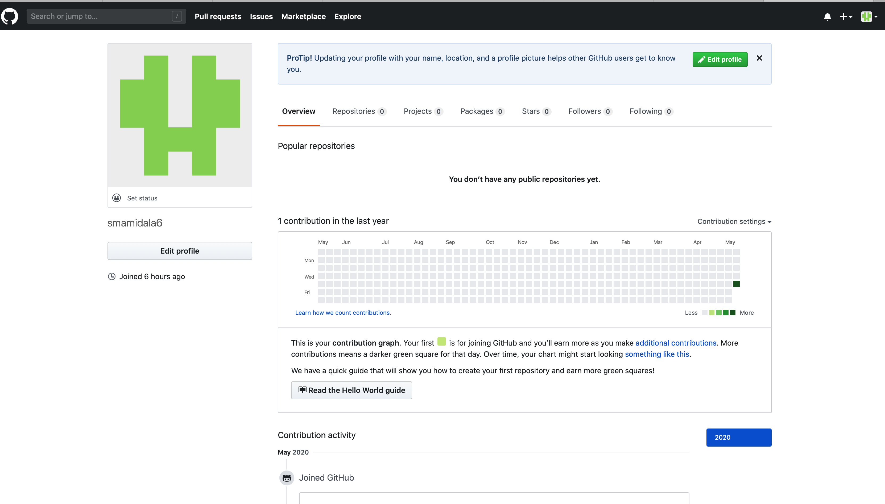
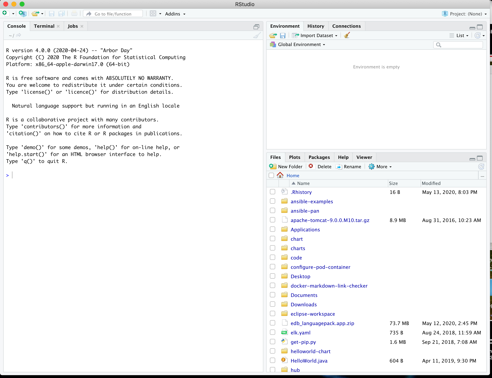

## Week - 1 Assignment 
### Installs

#### 1. Sqlda Tables in pgAdmin

#### 2. \l to show list of PostgreSQL databases

 
#### 3.	Idle page with Hello World script

#### 4.	GitHub

#### 5.	Rstudio

